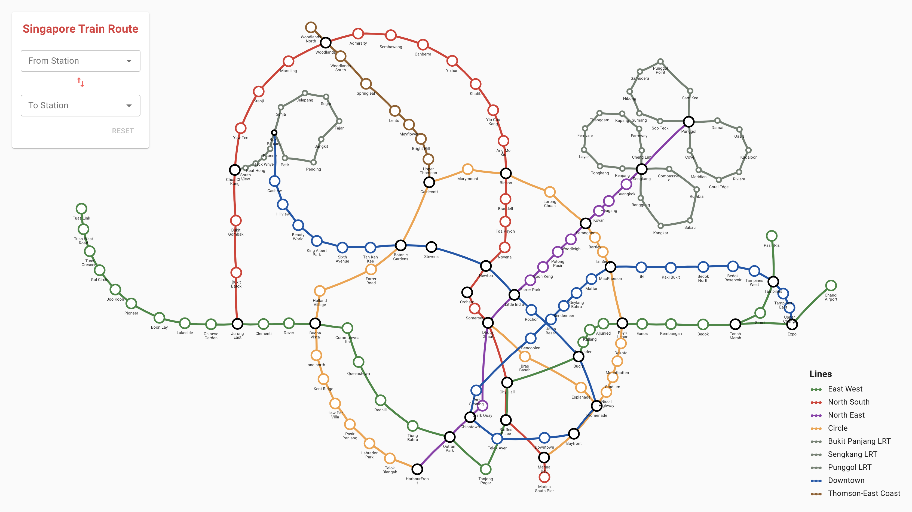
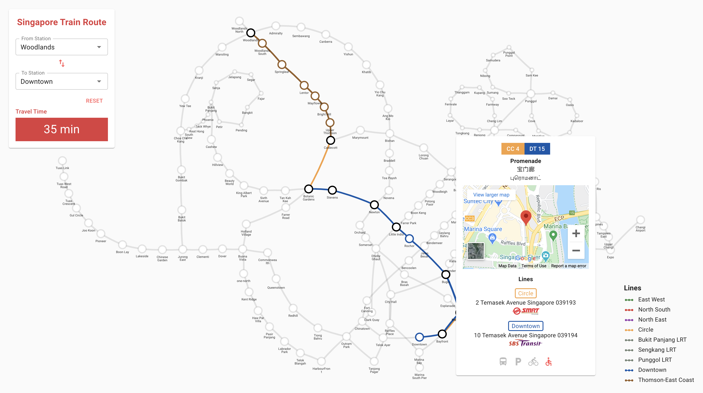

# Singapore Train Route

This project computes the shortest path between train stations in Singapore's rail network.

It uses [Spring Boot](https://start.spring.io) for backend, [React](https://reactjs.org) for frontend, and [Neo4j](https://neo4j.com) for graph database.

The project uses the following:

- [Material-UI](https://material-ui.com/) for material design components
- [springboot-react](https://github.com/raemounz/springboot-react) as seed project.

## Preview

## Prerequisite
Install [Neo4j](https://neo4j.com/download-center/#community) in your local machine. You can either install the *Community Server* or the *Neo4j Desktop*.  The version used in this project is neo4j-4.2.3.  Download the following plugins and put them inside `<neo4j-installation-path>/plugins`:

- [apoc-4.2.0.2-all.jar](plugins/apoc-4.2.0.2-all.jar)
- [neo4j-graph-data-science-1.5.1.jar](plugins/neo4j-graph-data-science-1.5.1.jar)

Use the exact plugin versions if you have neo4j-4.2.3 installed.

Update `<neo4j-installation-path>/conf/neo4j.conf` and make sure you have the following line uncommented:

`dbms.security.procedures.unrestricted=gds.*`

## Installation

If you installed the *Community Server*, run `<neo4j-installation-path>/bin/neo4j start` to start the neo4j server.  If you installed the *Neo4j Desktop* instead, just create a new graph database and start it.

Run the following command to populate the network graph.  This is just a one-time setup.

`<neo4j-installation-path>/bin/cypher-shell --file <project-directory>/sg-train-route/src/main/resources/sg_trains.cql`

## Build

To build the project for production, run `mvn clean install -Pnpm-build`.

The build artifacts will be stored in the `target/` directory.

## Run

Run the following in the command prompt:

`java -jar target/sg_train_route-0.0.1-SNAPSHOT.jar`

Navigate to http://localhost:8080/.